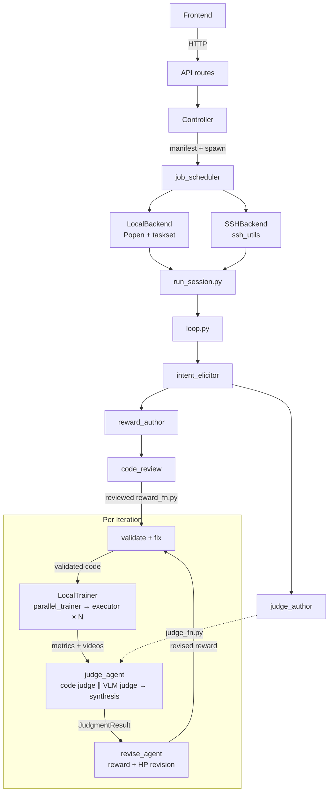

# Prompt2Policy Architecture

## Overview

Prompt2Policy = LLM-driven reward shaping for MuJoCo and IsaacLab environments.

For the high-level agentic workflow (intent → reward → train → judge → revise loop), see [README.md](../README.md#how-it-works). This document covers the code-level architecture.

## Execution Flow

All tabs (E2E, Benchmark, Scheduler) use a single execution path:



### Trainer vs Backend — Two Levels of Execution

| | Trainer Protocol | Backend Protocol |
|---|---|---|
| **Level** | Loop-level (per iteration) | Scheduler-level (per job) |
| **Question** | *How to run a training iteration* | *Where to launch a job* |
| **Caller** | `loop.py` → `iteration_runner` | `job_scheduler.py` |
| **Interface** | `Trainer.train(configs, seeds) → IterationAggregation` | `Backend.submit(spec) → RunStatus` |
| **Implementations** | `LocalTrainer` (→ parallel_trainer → Popen) | `LocalBackend`, `SSHBackend` |
| **Future** | `ScheduledTrainer` (→ Scheduler → SSHBackend) | `K8sBackend`, `SLURMBackend`, `RayBackend` |

**Trainer** = *what* to train (configs × seeds → aggregation). Called inside the loop per iteration.
**Backend** = *where* to run (local subprocess vs SSH node). Called by job_scheduler per job.

## Module Map

Source tree with inline annotations:

```
src/p2p/
    # Root — foundational modules imported by most subpackages
    contracts.py           # TypedDict data contracts (SSOT)
    settings.py            # Environment variable loading (import before gymnasium)
    config.py              # LoopConfig / TrainConfig dataclasses
    event_log.py           # Event logging

    # Session lifecycle & orchestration
    session/
        loop.py            # E2E orchestrator (generate → train → judge → revise)
        iteration_runner.py # Unified training iteration (calls trainer.train())
        iteration_record.py # Typed directory accessor (IterationRecord, SessionRecord)
        lineage.py         # Cross-iteration best-tracking
        session_id.py      # Session ID generation
        run_session.py     # Subprocess CLI: python -m p2p.session.run_session

    # LLM-driven agents
    agents/
        reward_author.py   # LLM reward generation + review loop
        judge_agent.py     # VLM/code judge + synthesis (3 strategies)
        judge_author.py    # LLM judge code generation + review loop
        revise_agent.py    # Multi-checkpoint reward revision (tool-use)
        revise_tool_dispatch.py # Tool handler dispatch
        intent_elicitor.py # Intent extraction from prompts
        session_analyzer.py # Post-session analysis

    # LLM/VLM inference infrastructure
    inference/
        llm_client.py     # LLM API wrapper (Anthropic)
        agent_tools.py    # Shared tool-use helpers
        vlm.py            # VLM providers (Gemini/Claude/vLLM/Ollama)
        vllm_server.py    # vLLM server lifecycle

    # RL training & resource management
    training/
        trainer.py         # Trainer Protocol + LocalTrainer
        sb3_trainer.py     # SB3 PPO backend + eval (shared MuJoCo/IsaacLab)
        runner.py          # Single training run
        parallel_trainer.py # LocalTrainer impl: Popen × configs × seeds
        env.py             # CustomRewardWrapper + IsaacLabRewardVecWrapper + make_env
        env_spec.py        # Env spec registry (MuJoCo + IsaacLab)
        simulator.py       # SimulatorBackend protocol + get_simulator() factory
        isaaclab_backend.py # IsaacLabBackend: body info, side info, rotation conventions
        reward_function.py # ABC: all reward functions implement this
        reward_loader.py   # importlib loader + legacy wrapping
        hp_presets.py      # Per-environment hyperparameter presets
        cpu_manager.py     # CPU core allocator (singleton)
        _isaaclab_registry.py # Auto-generated IsaacLab env specs + HP presets

    evaluator_isaaclab.py  # IsaacLab eval subprocess (GPU rendering)
    resource_auto.py       # Auto resource detection

    # Analysis & guardrails
    analysis/
        trajectory_metrics.py # Per-reward-term breakdown (mean, std, trend, share)
        training_dynamics.py  # Training curve analysis
        guardrails.py         # Reward hacking + plateau detection

    # Benchmark tooling
    benchmark/
        benchmark_helpers.py # Session info + manifest helpers
        benchmark_cli.py     # CLI: python -m p2p.benchmark.benchmark_cli

    # Utilities
    utils/
        utils.py           # Text extraction, log reading, code review
        subprocess_utils.py # Python subprocess launcher

    executor/              # CLI: python -m p2p.executor (used by parallel_trainer)
    scheduler/             # Unified job scheduling (controllers, backends, SSH)
    api/                   # FastAPI REST API
    prompts/               # LLM prompt templates
    rewards/               # Built-in reward functions
```

## Core Interfaces

### 1. RewardFunction ABC

All reward functions implement this interface. Legacy `def reward_fn(...)` functions
are auto-wrapped by the loader.

```python
from abc import ABC, abstractmethod

class RewardFunction(ABC):
    @abstractmethod
    def compute(self, obs, action, next_obs, info) -> tuple[float, dict[str, float]]:
        ...

    @property
    @abstractmethod
    def latex(self) -> str: ...

    @property
    @abstractmethod
    def terms(self) -> dict[str, str]: ...

    @property
    def description(self) -> str:
        return ""  # optional override

    def __call__(self, obs, action, next_obs, info):
        return self.compute(obs, action, next_obs, info)
```

Backward compatibility: `__call__` delegates to `compute`, so existing code
that calls `reward_fn(obs, action, next_obs, info)` works without changes.

### 2. IterationRecord (Iteration Directory Contract)

Typed accessor for the iteration directory filesystem layout:

```python
class IterationRecord:
    path: Path              # runs/session_xxx/iter_N/
    iteration_id: str       # directory name
    config_path: Path       # config.json
    reward_fn_path: Path    # reward_fn.py
    reward_spec_path: Path  # reward_spec.json
    summary_path: Path      # summary.json
    scalars_path: Path      # metrics/scalars.jsonl
    trajectory_path: Path   # latest trajectory_*.npz (with legacy .jsonl fallback)
    prompt_path: Path       # prompt.txt
    videos_dir: Path        # videos/
    status_path: Path       # status.json
    judgment_path: Path     # judgment.json (evaluator writes)
    revised_reward_path: Path  # reward_fn_revised.py (evaluator writes)

    def read_config(self) -> dict | None: ...
    def read_summary(self) -> TrainSummary | None: ...
    def read_reward_source(self) -> str: ...
    def read_reward_spec(self) -> RewardSpec: ...
    def read_judgment(self) -> JudgmentResult | None: ...
    def save_config(self, config: TrainConfig) -> None: ...
    def save_reward_source(self, source: str) -> None: ...
    def save_reward_spec(self, spec: RewardSpec) -> None: ...
    def save_summary(self, summary: TrainSummary) -> None: ...
    def save_judgment(self, judgment: JudgmentResult) -> None: ...
    def save_revised_reward(self, code: str) -> None: ...
    def set_status(self, status: StatusLiteral, error: str | None = None) -> None: ...
    def derive_status(self) -> str: ...        # pending/running/completed/cancelled/unknown
    def compute_progress(self) -> float | None: ...
    def video_filenames(self) -> list[str]: ...
    def parse_scalars(self) -> tuple[list[dict], list[dict]]: ...  # (training, evaluation)
    def validate(self) -> list[str]: ...       # list of missing/invalid items
```

### 3. SessionRecord (Session Directory Contract)

```python
class SessionRecord:
    path: Path              # runs/session_xxx/
    session_id: str         # directory name
    status_path: Path       # status.json
    history_path: Path      # loop_history.json
    metadata_path: Path     # metadata.json
    analysis_path: Path     # analysis.json

    def set_status(self, status: StatusLiteral, error: str | None = None) -> None: ...
    def read_status(self) -> StatusData | None: ...
    def touch_heartbeat(self) -> None: ...
    def save_history(self, data: dict) -> None: ...
    def read_history(self) -> dict | None: ...
    def read_metadata(self) -> EntityMetadata: ...
    def save_metadata(self, data: EntityMetadata) -> None: ...
    def update_metadata(self, **kwargs) -> EntityMetadata: ...
    def save_analysis(self, data: dict) -> None: ...
    def read_analysis(self) -> dict | None: ...
    def iteration_records(self) -> list[IterationRecord]: ...
    def get_iteration(self, iteration_id: str) -> IterationRecord | None: ...
```

### 4. Directory Layouts

For directory structure (single-config / multi-config), see [README.md Directory Layout](../README.md#directory-layout).

## Input Formats

### Reward Function File (.py)

Two formats are supported. The file is loaded via `reward_loader.load_from_file()`.

**Class-based (recommended):**
```python
from p2p.training.reward_function import RewardFunction

class SpeedReward(RewardFunction):
    def compute(self, obs, action, next_obs, info):
        v = float(info.get("x_velocity", 0.0))
        ctrl = -0.1 * float(sum(a**2 for a in action))
        return v + ctrl, {"speed": v, "ctrl": ctrl}

    @property
    def latex(self):
        return r"r = v_x - 0.1 \|a\|^2"

    @property
    def terms(self):
        return {"speed": "forward velocity", "ctrl": "control penalty"}
```

**Legacy function (also supported):**
```python
def reward_fn(obs, action, next_obs, info):
    """
    LaTeX: r = v_x
    Terms:
        speed: forward velocity
    """
    v = float(info.get("x_velocity", 0.0))
    return v, {"speed": v}
```

**Environment details (HalfCheetah-v5):**
- `obs`, `next_obs`: `np.ndarray` shape (17,) — joint angles, velocities
- `action`: `np.ndarray` shape (6,) — torques on 6 joints
- `info` keys: `x_velocity`, `x_position`, `reward_ctrl`, `reward_forward`
- Return: `(float, dict[str, float])` — total reward + named terms
- `numpy` (as `np` / `numpy`) is available in the execution namespace; `mujoco` is also available if installed

### Config File (.json)

Optional JSON file matching `TrainConfig` fields. Omit to use defaults.

```json
{
    "total_timesteps": 1000000,
    "learning_rate": 0.0003,
    "gamma": 0.99,
    "num_steps": 2048,
    "num_envs": 1,
    "seed": 1,
    "env_id": "HalfCheetah-v5"
}
```

See `src/p2p/config.py` for all available fields and defaults.

## CLI Interfaces

### Executor
```bash
python -m p2p.executor \
    --reward-fn path/to/reward.py \
    --config config.json \          # optional, defaults to TrainConfig()
    --runs-dir runs/ \              # optional
    --env-id HalfCheetah-v5 \       # optional
    --iteration-id iter_1           # optional override
```
Loads reward via `reward_loader`, runs `run_training()`, prints iteration_dir.

## API Endpoints

### Session & Iteration
```
POST /api/sessions                                             → StartSessionResponse
GET  /api/sessions                                             → list[SessionDetail]
GET  /api/sessions/{session_id}                                → SessionDetail
POST /api/sessions/{session_id}/stop                           → StopResponse
PATCH /api/sessions/{session_id}                               → UpdateMetadataResponse
DELETE /api/sessions/{session_id}                               → StopResponse (soft delete)
POST /api/sessions/{session_id}/restore                        → StopResponse
GET  /api/sessions/{session_id}/loop-iterations                → list[LoopIterationSummary]
GET  /api/sessions/{session_id}/iterations/{iteration_id}      → IterationDetail
GET  /api/sessions/{session_id}/iterations/{iter_num}/runs      → list[IterationRunEntry]
GET  /api/sessions/{session_id}/iterations/{iter_num}/runs/{run_id}/metrics → RunMetricsResponse
GET  /api/sessions/{session_id}/analysis                       → SessionAnalysisResponse
POST /api/sessions/{session_id}/analyze                        → SSE stream
GET  /api/sessions/{session_id}/events                         → list[EventSummary]
GET  /api/sessions/{session_id}/events/{seq}                   → EventDetail
GET  /api/iterations                                           → list[IterationSummary]
GET  /api/iterations/{iteration_id}                            → IterationDetail
GET  /api/iterations/{iteration_id}/metrics                    → MetricsResponse
```

### Benchmark
```
GET  /api/benchmarks/options            → BenchmarkOptionsResponse
POST /api/benchmarks                    → StartBenchmarkResponse
GET  /api/benchmarks                    → list[BenchmarkRunSummary]
GET  /api/benchmarks/{benchmark_id}     → BenchmarkRunDetail
POST /api/benchmarks/{benchmark_id}/stop → StopBenchmarkResponse
PATCH /api/benchmarks/{benchmark_id}    → UpdateMetadataResponse
DELETE /api/benchmarks/{benchmark_id}   → StopResponse
POST /api/benchmarks/{benchmark_id}/restore → StopResponse
```

### Misc
```
GET  /api/envs                          → list[EnvInfo]
GET  /api/reward-templates              → list[RewardTemplateInfo]
GET  /api/resources/status              → ResourceStatusResponse
GET  /api/trash                         → list[TrashItem]
DELETE /api/trash/{entity_id}           → StopResponse (permanent delete)
POST /api/vlm/api/chat                  → VlmChatResponse
GET  /api/vlm/api/tags                  → Ollama-compatible tag list
GET  /api/vlm/status                    → VlmStatusResponse
```

## schemas.py ↔ contracts.py Mapping

API Pydantic models (`api/schemas.py`) derive from internal TypedDict contracts (`contracts.py`).
This table documents the mapping to prevent field drift.

### Direct Mirrors (identical fields)

| schemas.py (Pydantic) | contracts.py (TypedDict) | Notes |
|------------------------|--------------------------|-------|
| `IterationRunEntry` | `IterationRunInfo` | Same fields, different name |
| `MeanStdArray` | `MeanStdSeries` | Same fields, different name |
| `AggregatedMetricsResponse` | `AggregatedMetrics` | 1:1 |
| `RunMetricsResponse` | `RunMetricsDetail` | 1:1 |
| `RunConfigEntrySchema` | `RunConfigEntry` | 1:1 |
| `SessionAnalysisResponse` | `SessionAnalysis` | 1:1 |

### Composite Derivations (multiple contracts → one schema)

| schemas.py | Source contracts | Relationship |
|------------|-----------------|--------------|
| `SessionDetail` | `LoopResult` + `EntityMetadata` | session_id/prompt/status/best_* from LoopResult; alias/starred/tags from EntityMetadata |
| `LoopIterationSummary` | `JudgmentResult` + `ReviseResult` + `IterationAggregation` | intent_score/diagnosis/failure_tags from JudgmentResult; reward_code/hp_changes from ReviseResult; aggregation from IterationAggregation |
| `IterationSummary` | `TrainSummary` + `RewardSpec` | final_episodic_return from TrainSummary; reward_latex/reward_description from RewardSpec |
| `IterationDetail` | `IterationSummary` + `TrainSummary` + `RewardSpec` + `JudgmentResult` | Extends IterationSummary with full config/summary/judgment |

### Corresponding Pairs (overlapping but not identical)

| schemas.py | contracts.py | Difference |
|------------|-------------|------------|
| `StartSessionRequest` | `SessionConfig` | Request has defaults + extra fields (use_zoo_preset, hp_tuning) |
| `UpdateMetadataRequest` | `EntityMetadata` | Request fields are all Optional (partial update) |

### API-Only Schemas (no contract equivalent)

These exist solely for the REST API and have no TypedDict counterpart:

`MetricsResponse`, `StartSessionResponse`,
`StopResponse`, `TrashItem`, `ResourceStatusResponse`, `EnvInfo`, `RewardTemplateInfo`,
VLM schemas (`VlmMessage`, `VlmChatRequest/Response`, `VlmStatusResponse`),
Benchmark schemas (`StartBenchmarkRequest/Response`, `BenchmarkRunSummary/Detail`, etc.),
Event schemas (`EventSummary`, `EventDetail`).

## Frontend Tabs

| Tab          | Route          | Purpose                              |
|--------------|----------------|--------------------------------------|
| **E2E**      | `/e2e`         | Automated loop sessions              |
| **Benchmark**| `/benchmark`   | Benchmark job submission, node management, and job dispatch |
| **Monitor**  | `/monitor`     | CPU/GPU resource monitoring          |
| **Trash**    | `/trash`       | Deleted/archived items               |

Additional pages:
- `/e2e/{sessionId}` — E2E session detail
- `/benchmark/{benchmarkId}` — Benchmark run detail
- `/benchmark/job/{jobId}` — Scheduler job detail
- `/benchmark/job/{jobId}/case/{caseIndex}` — Individual case view
