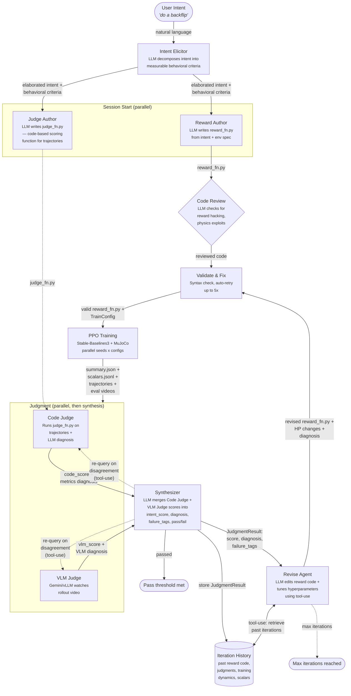

# Prompt2Policy User Guide

Detailed setup, usage, and configuration reference. For a quick overview, see the [README](../README.md). For code-level architecture, see [ARCHITECTURE.md](ARCHITECTURE.md).

## Pipeline Diagram



## Setup Details

For basic installation, see the [README Quick Start](../README.md#quick-start).

### Headless Rendering (Linux)

```bash
# Ubuntu 24.04+
sudo apt-get install -y xvfb libegl1 libgl1 libglu1-mesa

# Ubuntu 22.04
sudo apt-get install -y xvfb libegl1-mesa libgl1-mesa-glx libglu1-mesa
```

### install.sh

As an alternative to `uv sync --all-extras`, the `bash install.sh` one-command installer will:
- Check prerequisites (Python 3.11+, uv, Node.js 18+, GPU, MuJoCo system libraries)
- Install Python and frontend dependencies
- Prompt for API keys (Anthropic, Gemini, OpenAI) and write `.env`
- Auto-enable `MUJOCO_GL=egl` on GPU machines

## NVIDIA MPS (Optional)

When running multiple training experiments on a single GPU, enable [NVIDIA MPS](https://docs.nvidia.com/deploy/mps/index.html) so concurrent processes share the GPU efficiently instead of context-switching:

```bash
# Start the MPS control daemon
sudo nvidia-cuda-mps-control -d

# Verify it is running
echo get_server_list | nvidia-cuda-mps-control

# Stop MPS when no longer needed
echo quit | sudo nvidia-cuda-mps-control
```

MPS is recommended when `--max-parallel` > 1 in benchmark or loop sessions. Without MPS, each process gets exclusive GPU access and serializes rendering calls.

## Running a Single Training

```bash
uv run python -m p2p.executor --reward-fn path/to/reward.py
```

Example reward file:

```python
from p2p.training.reward_function import RewardFunction

class SpeedReward(RewardFunction):
    def compute(self, obs, action, next_obs, info):
        v = float(info.get("x_velocity", 0.0))
        ctrl = -0.1 * float(sum(a**2 for a in action))
        return v + ctrl, {"speed": v, "ctrl": ctrl}

    @property
    def latex(self):
        return r"r = v_x - 0.1 \|a\|^2"

    @property
    def terms(self):
        return {"speed": "forward velocity", "ctrl": "control penalty"}
```

## Dashboard

See [Quick Start (Dashboard)](../README.md#run-dashboard) for the server startup commands.

> **Note**: Always use `--reload-dir src` with `--reload`. Without it, training output
> under `runs/` triggers server reloads, killing active sessions.

### Remote Access

When running the dashboard on a remote server (AWS, cloud VM, etc.), the frontend needs to know the server's public address to make API calls from your browser. By default it calls `http://localhost:8000`, which won't work remotely.

Create `frontend/.env.local`:

```bash
echo "NEXT_PUBLIC_API_URL=http://<your-server-ip>:8000" > frontend/.env.local
```

Then restart the frontend. Without this, the landing page and E2E page will show empty env lists and the benchmark tab will show no test suites.

Start a session via API:

```bash
curl -X POST http://localhost:8000/api/sessions \
    -H "Content-Type: application/json" \
    -d '{"prompt": "run forward fast", "env_id": "HalfCheetah-v5", "total_timesteps": 1000000}'
```

### Tabs

| Tab | Route | Purpose |
|-----|-------|---------|
| **E2E** | `/e2e` | Automated loop sessions — start, monitor, inspect iterations |
| **Benchmark** | `/benchmark` | Benchmark job submission and result comparison |
| **Trash** | `/trash` | Deleted/archived sessions and benchmarks |
| **Monitor** | `/monitor` | CPU/GPU resource monitoring |

## Writing Effective Intents

The more specific your intent description, the better the resulting behavior. A detailed intent gives the reward author enough context to generate a well-shaped reward function on the first iteration, reducing the number of loop cycles needed.

**Tips:**
- **Describe the motion**, not just the goal — mention gait, rhythm, posture, and limb coordination
- **Specify constraints** — what the agent should *avoid* (e.g., excessive sway, dragging feet)
- **Include style cues** — "natural", "aggressive", "steady", "explosive" help shape the reward

**Examples:**

| | Intent | Quality |
|---|--------|---------|
| :x: | *"walk forward"* | Too vague — the agent may shuffle, hop, or drag itself forward |
| :white_check_mark: | *"Walk forward with a natural human-like gait, alternating left and right steps in a steady rhythm with a consistent stride length, while gently swinging the opposite arm forward with each step, keeping the torso upright and avoiding excessive lateral sway"* | Specific enough to produce natural walking |
| :x: | *"do a backflip"* | Unclear on takeoff, rotation, or landing expectations |
| :white_check_mark: | *"Jump vertically with both legs, perform a full backward rotation in the air, and land on both feet without falling over"* | Defines the full motion sequence and success criteria |

## Supported LLM Models

Set via `LLM_MODEL` env var or the dashboard model selector. Default: `claude-opus-4-6`.

The provider is auto-detected from the model name prefix (`claude-*` = Anthropic, `gpt-*` / `o1*` / `o3*` / `o4*` = OpenAI, `gemini*` = Google).

| Model ID | Provider | Notes |
|----------|----------|-------|
| `claude-opus-4-6` | Anthropic | Most capable. Supports `max` thinking effort. Default. |
| `claude-sonnet-4-6` | Anthropic | Faster. Thinking up to `high` effort. |
| `gpt-5.4` | OpenAI | Latest OpenAI flagship. |
| `gpt-5.3-codex` | OpenAI | Code-optimized reasoning model. |
| `gemini-3.1-pro-preview` | Google | Deep thinking. Supports `minimal` effort. |
| `gemini-3-flash-preview` | Google | Fast and cost-efficient. |

## IsaacLab Installation

Isaac Sim 5.1 requires **Python 3.11** (no cp312 wheels are published). Make sure
your venv was created with `uv sync --all-extras --python 3.11`.

**Step 0: Install system dependencies**

Isaac Sim needs several system libraries that are not installed by default on headless servers:

```bash
# Ubuntu 24.04+
sudo apt-get install -y xvfb libxt6 libglu1-mesa libegl1 libgl1 libvulkan1

# Ubuntu 22.04
sudo apt-get install -y xvfb libxt6 libglu1-mesa libegl1-mesa libgl1-mesa-glx libvulkan1
```

**Step 1: Install Isaac Sim and IsaacLab deps**

```bash
uv pip install "isaacsim[all,extscache]==5.1.0.0" \
  --extra-index-url https://pypi.nvidia.com \
  --index-strategy unsafe-best-match
uv pip install "p2p[isaaclab-deps]"
echo "Yes" | uv run python -c "import isaacsim"   # Accept NVIDIA EULA (one-time)
```

**Step 2: Install IsaacLab source packages**

```bash
git clone https://github.com/isaac-sim/IsaacLab.git /path/to/IsaacLab

uv pip install --no-deps -e /path/to/IsaacLab/source/isaaclab/
uv pip install --no-deps -e /path/to/IsaacLab/source/isaaclab_tasks/
uv pip install --no-deps -e /path/to/IsaacLab/source/isaaclab_contrib/
uv pip install --no-deps -e /path/to/IsaacLab/source/isaaclab_assets/
```

**Step 3: Verify**

```bash
echo "Yes" | uv run python -c "
from isaacsim import SimulationApp
app = SimulationApp({'headless': True})
import isaaclab_tasks, gymnasium as gym
isaac = [e for e in gym.registry if e.startswith('Isaac-')]
print(f'{len(isaac)} IsaacLab envs registered')
app.close()
"
```

Requirements: NVIDIA GPU with CUDA 12+, driver 525+, GLIBC 2.35+ (Ubuntu 22.04+).

To update the env registry after upgrading IsaacLab:

```bash
uv run python scripts/sync_isaaclab_envs.py /path/to/IsaacLab
```

> [!WARNING]
> **`uv sync` / `uv add` wipes IsaacLab packages.**
> These editable installs are not declared in `pyproject.toml` (to avoid
> version conflicts with isaacsim's strict pins), so `uv sync` removes them.
> After any `uv sync` or `uv add`, re-run Step 2 above to restore them.

**Known limitations**: ~10s `SimulationApp` startup per process; batched envs (num_envs=4096) can use 8+ GB VRAM; IsaacLab envs are GPU-vectorized (uses `Sb3VecEnvWrapper`, not `SubprocVecEnv`).

## Directory Layout

```
runs/
├── session_{id}/
│   ├── status.json              # Session status
│   ├── session_config.json      # LoopConfig snapshot
│   ├── loop_history.json        # Iteration history and best score
│   ├── subprocess.log           # Session stdout/stderr
│   ├── events.jsonl             # Structured event log
│   │
│   └── iter_{N}/               # Each iteration
│       ├── config.json             # Training hyperparameters
│       ├── reward_fn.py            # Generated reward function
│       ├── reward_spec.json        # {latex, terms, description}
│       ├── summary.json            # Final training metrics
│       ├── judgment.json           # Judge result (score, diagnosis)
│       ├── metrics/scalars.jsonl   # Training + eval scalar metrics
│       └── videos/                 # Evaluation rollout videos
│
└── scheduler/
    └── jobs/
        └── {job_id}/
            ├── manifest.json   # Job state
            └── scheduler.log   # Scheduler log
```

## Related Work

Prompt2Policy builds on ideas from Eureka, Text2Reward, DrEureka, CARD, ReEvo, RLZero, AutoResearch, AI Scientist v2, POISE, and EvoX.
